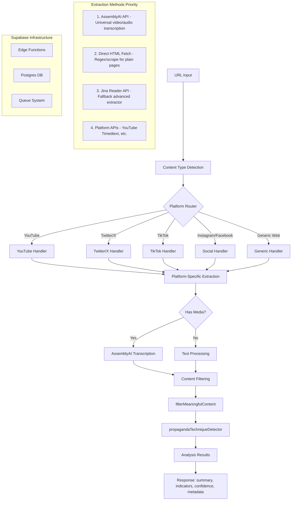

# Propaganda Lens AI - Architecture Documentation

## Overview

Propaganda Lens AI is a Supabase-first serverless application that analyzes web content for propaganda techniques. The system uses a modern API-first approach with intelligent fallbacks to ensure robust content extraction across various platforms.

## Architecture Flow Diagram



## Extraction Methods

### 1. AssemblyAI API (Primary)
- **Purpose**: Universal video/audio transcription across all platforms
- **When it fires**: Whenever video/audio content is detected without existing captions
- **Capabilities**: Handles MP4, audio streams, various codecs
- **Rate limits**: Based on API plan
- **Fallback**: Platform-specific APIs or Jina Reader

### 2. Direct HTML Fetch
- **Purpose**: Basic content extraction from static web pages
- **When it fires**: For generic web pages without special handling needs
- **Capabilities**: Meta tag extraction, body text parsing
- **Limitations**: No JavaScript rendering, regex-based parsing
- **Fallback**: Jina Reader API

### 3. Jina Reader API
- **Purpose**: Advanced content extraction with AI-powered parsing
- **When it fires**: When direct fetch fails or returns insufficient content
- **Capabilities**: Handles complex layouts, removes boilerplate
- **Rate limits**: Based on API key tier
- **Fallback**: None (last resort)

### 4. Platform APIs
- **YouTube Timedtext**: Direct transcript API for YouTube videos
- **Twitter API v2**: Full tweet threads, media metadata
- **Others**: Platform-specific endpoints as available

## Platform Handlers

### Twitter/X Handler
```typescript
// Flow: URL → Tweet ID → API v2 → Text + Media → AssemblyAI (if video) → Analysis
- Fetches full tweet thread using conversation_id
- Extracts all media attachments
- Transcribes video/audio content without captions
- Combines all text sources
```

### YouTube Handler
```typescript
// Flow: URL → Video ID → Timedtext API → Fallback to AssemblyAI → Analysis
- Attempts YouTube's native transcript API first
- Falls back to AssemblyAI for videos without captions
- Extracts video metadata
```

### TikTok Handler
```typescript
// Flow: URL → Video ID → AssemblyAI → Analysis
- Direct to AssemblyAI (no official transcript API)
- Handles short-form video content
```

### Instagram/Facebook Handler
```typescript
// Flow: URL → Post ID → Content Extraction → Filter UI → Analysis
- Removes platform UI noise
- Extracts post text and captions
- Handles reels via AssemblyAI
```

### Generic Web Handler
```typescript
// Flow: URL → HTML Fetch → Meta Tags + Body → Jina Fallback → Analysis
- OpenGraph and Twitter Card parsing
- Intelligent content extraction
- Removes navigation, ads, boilerplate
```

## Supabase Deployment

### Edge Functions
- **extract**: Entry point, validates URLs, creates jobs
- **worker**: Processes extraction queue, calls handlers
- **analyze**: Runs propaganda detection on extracted content

### Database Schema
```sql
-- extraction_jobs table
id, url, status, created_at, processed_at, result

-- analysis table  
id, url, content, summary, indicators, confidence, metadata, created_at
```

### Environment Variables
```env
SUPABASE_URL=
SUPABASE_SERVICE_ROLE_KEY=
ASSEMBLYAI_API_KEY=
X_BEARER_TOKEN=
JINA_API_KEY=
```

## Comparison: Old vs New Architecture

| Feature | Old (Vercel/Whisper) | New (Supabase/AssemblyAI) |
|---------|---------------------|---------------------------|
| **Deployment** | Vercel Functions | Supabase Edge Functions |
| **Transcription** | Self-hosted Whisper | AssemblyAI API |
| **Audio Processing** | FFmpeg + yt-dl-exec | Direct API calls |
| **Scalability** | Limited by compute | API-based, unlimited |
| **Cold Starts** | Slow (heavy deps) | Fast (lightweight) |
| **Error Handling** | Timeout issues | Robust with retries |
| **Cost Model** | Compute time | API calls |
| **Platform Support** | YouTube-focused | Universal |

## Rate Limiting Strategy

- Twitter API: 450 requests/15 min → p-limit(15)
- AssemblyAI: Based on plan → queue with backoff
- Jina Reader: 10,000 requests/month → cache results
- Edge Functions: 1000 invocations/hour → job queue

## Security Considerations

- All API keys in environment variables
- Service role key for Supabase admin operations
- Row-level security on public tables
- Input validation on all URL parameters

## Future Enhancements

1. **Caching Layer**: Redis/Upstash for repeated URLs
2. **Webhook Support**: Real-time analysis notifications  
3. **Batch Processing**: Multiple URLs in single request
4. **Custom Extractors**: Plugin system for new platforms
5. **ML Pipeline**: Fine-tuned propaganda detection models